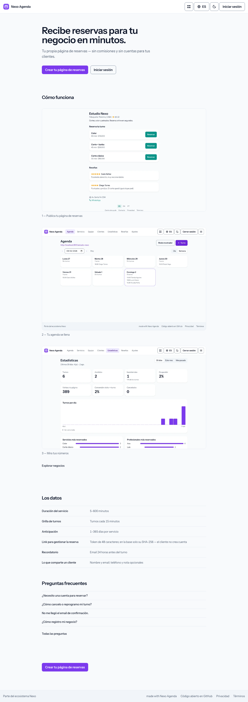
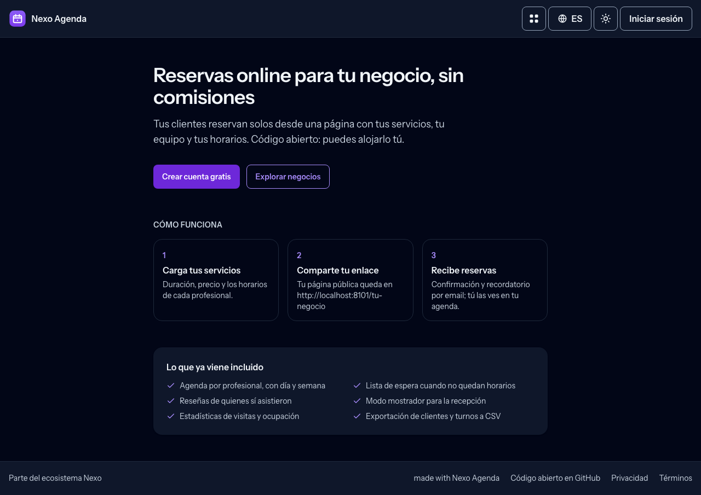
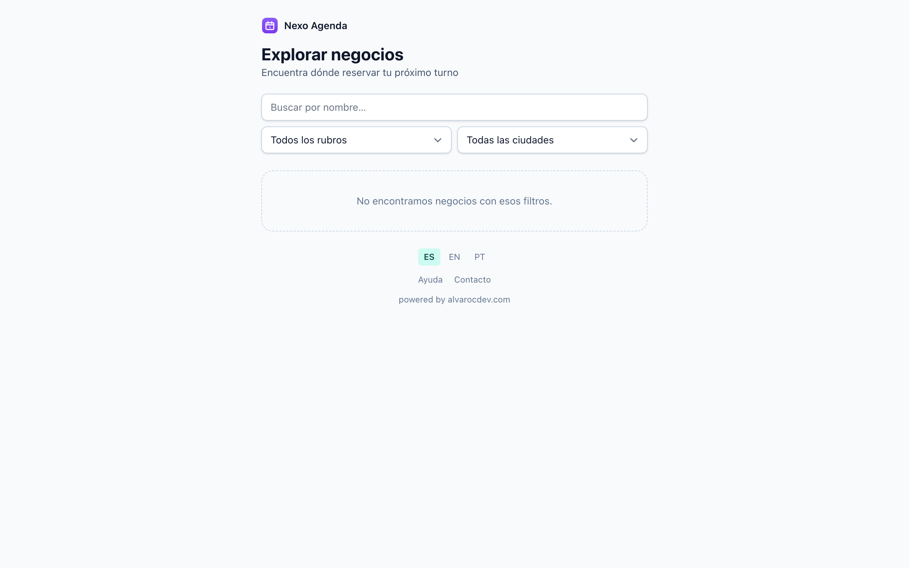
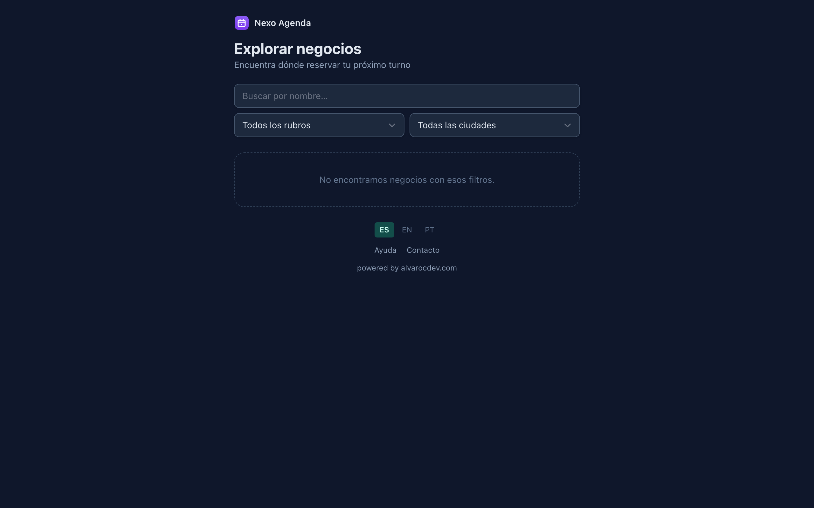

# Nexo Agenda

**Open source, self-hosted booking platform for service businesses.**
Own your bookings, your clients and your data — no monthly fee, no per-client
commission, no feature paywalls. Runs on cheap shared PHP hosting.

[**Live demo**](https://nexoagenda.alvarocdev.com) ·
[Deployment guide](DEPLOYMENT.md) ·
[Contributing](CONTRIBUTING.md) ·
[Scope & roadmap](docs/SCOPE.md)

---

Nexo Agenda is the **open source alternative to AgendaPro, Fresha and Booksy**:
a multi-business booking system where any business registers, sets up its
services and professionals, and gets a public booking page at `/{slug}`. Clients
book in seconds from a phone — **no account, no app**. It's the second product of
the **Nexo** family (sibling of [Nexo Links](https://nexolinks.alvarocdev.com)).

## Why it exists

Commercial booking tools charge monthly fees, take a commission on every new
marketplace client, gate reminders behind paid tiers, and make your data hard to
export. Nexo Agenda answers each of those pain points directly:

| Pain point in commercial tools | Nexo Agenda answer |
|---|---|
| 20% commission per marketplace client, price hikes | Self-hosted, free, **zero commissions** |
| WhatsApp / SMS reminders charged separately | Free prefilled `wa.me` links + email always included |
| No built-in reviews or feedback | Reviews with moderation, translatable help center |
| Data locked in, hard to export | One-click CSV export of clients and bookings |
| Native apps that crash | Mobile-first web, nothing to install |
| Account required to book | Guest booking with a hashed magic link |

## Screenshots

Captured from the live instance.

| Light | Dark |
| --- | --- |
|  |  |
|  |  |

Book something for real at the
[live demo](https://nexoagenda.alvarocdev.com/estudio-nexo).

## Features

**Booking core**
- Multi-business: open registration, reserved slugs, public page at `/{slug}`
- Services (in-person or virtual with a video link), buffers, min/max notice, cancellation window
- Professionals with weekly schedules and absences
- Timezone-aware availability engine
- Guest booking in 4 steps — no account — with a hashed **magic link** to view / cancel / reschedule
- Owner dashboard (day / week) + manual bookings

**Communications (zero external cost)**
- Branded confirmation, reminder and cancellation emails
- `.ics` calendar attachment + prefilled `wa.me` WhatsApp links
- Automatic 24h reminder via a scheduled command

**Differentiators**
- Light CRM per business (visit history, no-show count) + CSV export
- Waitlist with automatic cancellation notifications
- Per-professional `.ics` subscription feeds
- Per-business public-page theming (accent color, logo)
- Front-desk (counter) fast day view + QR check-in
- First-party, cookieless statistics (occupancy, no-shows, top services)
- Client reviews with moderation and public ratings
- Opt-in public directory `/explorar` with search by name/category/city and SEO category pages

**Quality & operations**
- **i18n** es / en / pt with a visible selector (custom generator, guardian test)
- Security headers + self-contained CSP (zero external requests), rate limiting, hashed tokens
- WCAG AA accessibility audited
- Public-page cache invalidated by model events, DB indexes and pagination from day one
- Branded, translated error pages (404/403/419/429/500/503)
- Dynamic `sitemap.xml` + `robots.txt`, help center and feedback system

## Tech stack

- **PHP 8.3+**, **Laravel 13**
- **Blade** + **Alpine.js** + **Tailwind CSS 4** (Vite)
- **MySQL** (portable to any Laravel-supported DB)
- **Pest**, **Pint**, **Larastan** (level 6)
- Zero external runtime requests: no CDNs, no Google Fonts, system font stack

## Self-hosting

A standard Laravel app: PHP 8.3+, MySQL, and anything from cheap shared hosting to a
VPS. Multi-instance by design — your bookings and your clients' data stay in your
database, with no commission and no per-client fee.

**[DEPLOYMENT.md](DEPLOYMENT.md)** has the real steps: running it locally, the
environment reference (attribution, optional Nexo ID SSO, mail) and the production
deploy.

## Contributing

Contributions are welcome — read **[CONTRIBUTING.md](CONTRIBUTING.md)** and our
**[Code of Conduct](CODE_OF_CONDUCT.md)**. Found a security issue? See
**[SECURITY.md](SECURITY.md)** (please don't open a public issue).

## Documentation

- [`docs/SCOPE.md`](docs/SCOPE.md) — value proposition, domain model, roadmap
- [`docs/DECISIONS.md`](docs/DECISIONS.md) — architectural decision log
- [`docs/BRAND.md`](docs/BRAND.md) — brand, palette, isotype
- [`docs/WIREFRAMES.md`](docs/WIREFRAMES.md) — screen wireframes

## Nexo ecosystem

Nexo is a family of open-source, self-hostable tools that share one visual identity,
one optional account ([Nexo ID](https://github.com/nexo-tools/nexo-id) SSO) and one set of
engineering standards. Every tool runs **fully standalone** — the ecosystem is opt-in.

| Tool | What it is | Live | Repo |
| --- | --- | --- | --- |
| **Nexo Tools** | Ecosystem hub — discover the tools and hop between them with one account | [nexotools.alvarocdev.com](https://nexotools.alvarocdev.com) | [nexo-tools](https://github.com/nexo-tools/nexo-tools) |
| **Nexo ID** | One account for every tool — OAuth 2.0 / OIDC SSO | [nexoid.alvarocdev.com](https://nexoid.alvarocdev.com) | [nexo-id](https://github.com/nexo-tools/nexo-id) |
| **Nexo Links** | Link-in-bio you host yourself (Linktree alternative) | [nexolinks.alvarocdev.com](https://nexolinks.alvarocdev.com) | [nexo-links](https://github.com/nexo-tools/nexo-links) |
| **Nexo Agenda** | Bookings for service businesses (Fresha / Booksy alternative) | [nexoagenda.alvarocdev.com](https://nexoagenda.alvarocdev.com) | — you are here |
| **Nexo Short** | URL shortener with private, cookieless stats | [nexoshort.alvarocdev.com](https://nexoshort.alvarocdev.com) | [nexo-short](https://github.com/nexo-tools/nexo-short) |
| **Nexo Events** | Event tickets, passes and QR check-in | [nexoevents.alvarocdev.com](https://nexoevents.alvarocdev.com) | [nexo-events](https://github.com/nexo-tools/nexo-events) |

New to Nexo? Start at **[nexotools.alvarocdev.com](https://nexotools.alvarocdev.com)**.
Built by **[alvarocdev.com](https://alvarocdev.com)** — the tech behind Nexo.

## License

[MIT](LICENSE) © [Alvaro Carrizales](https://alvarocdev.com) (alvarocdev)

---

Status: **live** at [nexoagenda.alvarocdev.com](https://nexoagenda.alvarocdev.com) —
businesses, services, professionals, availability and public booking pages, with
optional Nexo ID sign-in.
